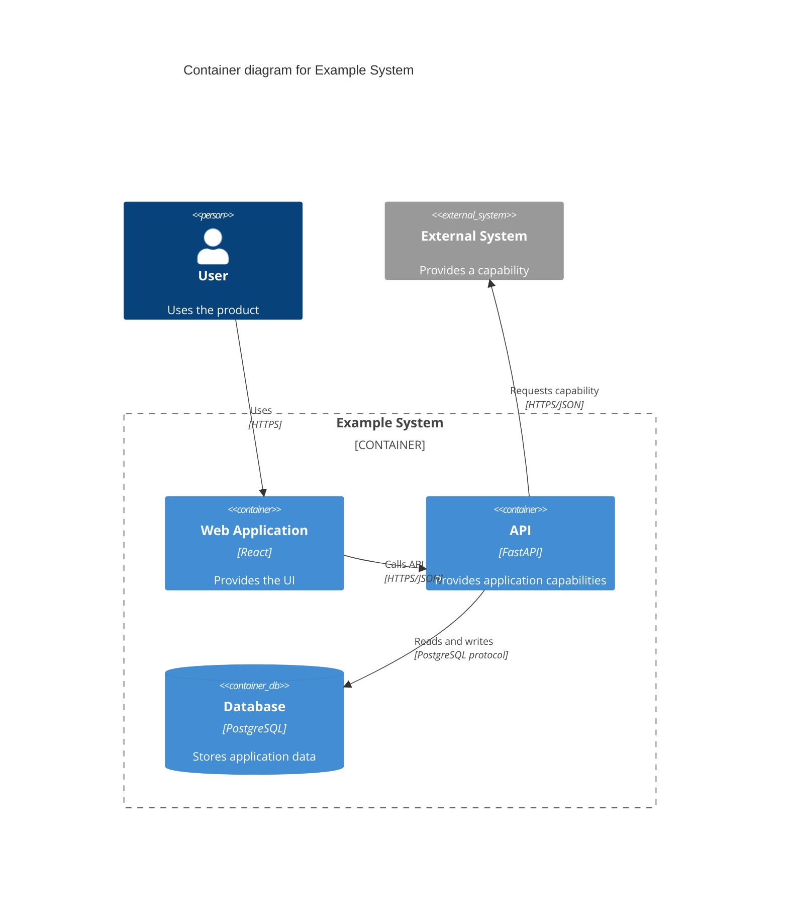

# C4 Diagrams in Mermaid

Create semantically correct, visually legible C4 diagrams. Legibility is correctness: arrows through boxes, text over nodes, overlapping labels, or unreadable crossings fail even when Mermaid parses.

C4 is notation-independent: preserve its abstraction, scope, naming, responsibilities, boundaries, and relationships regardless of renderer. Choose the renderer before syntax; build and prune an internal architecture graph, plan layout, then generate, render, inspect, and repair.

## 1. Semantics and communication

Abstractions (never mix casually):

| Type | Meaning |
|---|---|
| Person | Human role interacting with software |
| Software System | Deployable/owned software product or system delivering value |
| Container | Application/data store running independently or providing a runtime/data boundary; not Docker container |
| Component | Cohesive functionality behind a well-defined interface inside one container, not a folder/package |
| Code | Classes/functions/modules; normally outside Mermaid C4 architecture views |

| View | Scope and contents | Exclusions/constraints |
|---|---|---|
| System Context | System in scope, directly interacting people/external systems, high-level relationships: what it is, who uses it, what it interacts with | No containers, databases, frameworks, queues, deployment details. Every Person must have a recognizable person silhouette and `[Person]` label; see notation below. |
| Container | Major executable/data-store building blocks and communication: applications/services/workers/frontends, data stores, architecturally meaningful queues/topics, directly interacting people/external systems, major technologies and protocols | No classes, controllers, repositories, packages, pods, replicas, availability zones, nodes, regions, load balancers or other deployment details |
| Component | Components inside exactly one container plus necessary neighbours | Only when decomposition adds architectural understanding; never mirror the repository tree |
| Dynamic | One specific scenario/use case | Prefer `sequenceDiagram` for complex runtime interactions where ordering/readability matters; C4 dynamic views are notation-independent |
| Deployment | One environment/story: deployment nodes, infrastructure, instances, relevant runtime communication | Avoid deep nesting; it increases compound-graph layout risk |

Every diagram must stand mostly alone and have a title identifying type/scope, explicit element types, meaningful names, responsibilities for important elements, relevant container/component technologies, clear inside/outside ownership, labels on meaningful relationships, wording matching arrow direction, and useful inter-process protocols/technologies. Technology (e.g. `Python service`) does not replace responsibility. Reject mixed abstractions, unlabelled meaningful arrows, and exhaustive “everything” diagrams.

Use short directional verbs: `Submits orders`, `Calls order API`, `Reads and writes customer data`, `Publishes OrderCreated`, `Consumes inventory events`, `Sends e-mail`. Avoid `Uses`, `Data`, `API`, `Integration`, or imprecise `Calls`. Append protocol compactly: `Calls order API · HTTPS/JSON`. Never reverse arrows for layout.

## 2. Renderer selection and compatibility

Use native `C4Context`, `C4Container`, `C4Component`, `C4Dynamic`, or `C4Deployment` only when **all** hold, or the user explicitly requires native syntax:

- <= 6 visible elements; <= 7 relationships; no degree > 3;
- no nested boundaries; <= 2 external systems on the same side;
- short relationship labels; near-chain/tree graph;
- user explicitly benefits from native C4 syntax.

Otherwise default to **C4 semantics in `flowchart` + ELK** for quality-sensitive diagrams (subject to the Dynamic view preference above). ELK provides layered routing around nodes, crossing minimization, configurable spacing, model-order influence, and line hops; flowcharts support invisible constraints and minimum edge lengths.

Native C4 is experimental, uses legacy row/grid layout rather than fully automated layout, has realistic label/crossing problems and incomplete legends, and is migrating toward Mermaid's unified renderer. Do not expect it to route dense graphs.

Mermaid 12 bundles ELK and defaults to it for flowcharts; older installations may need ELK registration or fall back to Dagre. The flowchart `person` shape requires v11.3.0+. For known older targets, state requirements and use compatible configuration. Verify the exact target/current version when renderer behaviour matters; never invent unsupported syntax. Keep ELK boundaries shallow: nested subgraphs still have edge cases.

## 3. Internal graph and density gate

Never generate Mermaid directly from prose. First record:

```text
Node: id, name, c4_type (Person | Software System | Container | Component | Deployment Node),
      scope (internal | external), boundary_id (if any), technology (if applicable),
      responsibility, semantic_group (capability/domain)
Relationship: source, target, intent, protocol, importance (primary | secondary)
```

Prune irrelevant nodes/relationships before layout. Recommended visible limits: Context 3–10 nodes; Container 4–12 primary nodes; Component 4–12 components plus essential neighbours; Dynamic only scenario participants; Deployment only infrastructure needed for the selected environment/story.

**Trigger splitting if any:** > 14 visible boxes; > 18 meaningful relationships; static edge/node ratio > 1.7; degree >= 6; > 6 edges crossing one system/boundary border; several nodes connected to most others; multiple independent stories; many relationships crossing > 3 conceptual layers; repeated manual geometry hacks.

Split by capability, dependency neighbourhood, workflow, external integration set, operational concern, or subsystem **at the same C4 level**. Prefer two clear diagrams to one unreadable inventory; layout cannot solve excessive scope.

## 4. Deterministic layout planning

Before syntax, apply this simplified Sugiyama-style procedure in order:

1. **Direction.** Default static views to `LR`, especially request/data pipelines, people/frontends → APIs/services/data/externals, and multi-line boxes wider than tall. Prefer `TB` for many siblings per layer, excessive LR width, or natural vertical tiers. Choose the direction making most primary edges forward, not aesthetics alone.
2. **Entries/sinks.** Mark entries (people, UIs/frontends, inbound APIs, initiating upstream systems) and sinks (owned stores, outbound providers, terminal workers/notifications).
3. **Cycles.** Conceptually compute strongly connected components; collapse each cycle to a super-node for layering. Inside it, put the business entry first, keep members adjacent, and allow one/few backward edges rather than forcing all forward. Give a dominant cycle a focused view.
4. **Layers.** On the condensed DAG, `layer(entry) = 0`; `layer(v) = max(layer(parent) + 1)` over primary incoming parents. Adjust semantically: Person before first owned element; UI before API/application; API/application before invoked workers/domain services; primary store one layer after its main owner/user when practical; queue/topic between producers and consumers when clarifying async flow; upstream/downstream external before/after the owned element it invokes/is invoked by. Never impose a database row that creates long edges.
5. **Spans.** Compute `abs(layer(source) - layer(target))`. Target span 1 for most primary edges; secondary may span 2; >= 3 warns. If many span >= 3, re-layer, move dependencies near main consumers, split, or remove low-value transitive relationships.
6. **Within-layer order.** Initialize by boundary/group → semantic capability → main story → stable name tie-break. Run **4–8 iterations, each with a forward and backward barycentric sweep**: forward traverses layers left/top to right/bottom using neighbour positions in the previous layer; backward reverses traversal using the next layer. Sort by median/average neighbour position with stable ties. Do not rely solely on declaration order.
7. **Hubs.** For degree >= 4, place near neighbours' median, keep closest semantic neighbours adjacent, distribute neighbours on appropriate forward/backward sides, avoid layer extremes. For >= 6, strongly consider a focused hub view (also apply the density gate).
8. **Crossing risk.** Adjacent-layer edges `(a → b)` and `(c → d)` risk crossing when `pos(a) < pos(c)` and `pos(b) > pos(d)`, or vice versa. Minimize these inversions; treat non-adjacent/long edges as higher risk.
9. **Boundaries.** Use the fewest meaningful semantic boundaries, not decorative boxes; keep nesting <= 2 where possible, members contiguous, titles short. Avoid internal/external/internal alternation within a layer. Place externals near the boundary edge of their main relationship, not in an arbitrary external column.

After layering estimate layer count, maximum nodes per layer, and average node text width. Prefer LR when layers <= 6 and max layer width <= 4; test TB when width >= 5 or LR produces tall columns/excessive horizontal span. Changing orientation is a major repair step.

Example: `Customer → Web → API`; API → Orders DB, Payment Provider, Email Worker; Email Worker → SMTP Provider. Layers: 0 Customer, 1 Web, 2 API, 3 Orders DB/Payment Provider/Email Worker, 4 SMTP Provider. A sweep may order layer 3 as Orders DB/Email Worker/Payment Provider; keep Email Worker aligned toward SMTP Provider. Emit roughly planned order and let ELK refine it.

## 5. Flowchart configuration and notation

Baseline for Mermaid 12+:

```mermaid
---
config:
  layout: elk
  look: classic
  markdownAutoWrap: true
  flowchart:
    nodeSpacing: 80
    rankSpacing: 110
    curve: linear
    wrappingWidth: 220
  elk:
    preset: default
    mergeEdges: false
    layeringStrategy: NETWORK_SIMPLEX
    nodePlacementStrategy: BRANDES_KOEPF
    nodePlacementAlignment: BALANCED
    straightenEdges: true
    lineHops: true
    considerModelOrder: NODES_AND_EDGES
---
flowchart LR
```

Keep relationships/labels distinct with `mergeEdges: false`; use `lineHops` for unavoidable crossings, `linear` to avoid sweeping curves, generous spacing for labels, and `NETWORK_SIMPLEX` to reduce long edges. Reflect the layer/barycentric plan in declarations but let ELK improve it. Do **not** default `forceNodeModelOrder` to true; it may prevent crossing reduction.

Labels explicitly carry C4 semantics; shape/colour are secondary. Use `Name<br/>[Type: Technology]<br/>Short responsibility`. Use `subgraph` boundaries with short titles. Child nodes with external edges can cause Mermaid to ignore subgraph `direction`; do not depend on it.

**System Context people:** every human role (customers, administrators, employees, operators, internal/external users) needs a recognizable person glyph **and** `[Person]` text. In flowchart v11.3.0+ use `customer@{ shape: person, label: "Customer<br/>[Person]<br/>Buys products" }`. Never use this shape for bots, services, devices or software actors. In native C4 use `Person(...)`/`Person_Ext(...)`. On older flowchart renderers, use native C4 only if eligible; otherwise state v11.3.0+ is required. Never silently substitute rectangles.

Use this default starting body for non-trivial Container views. **Prepend the baseline frontmatter above with `nodeSpacing: 90`, `rankSpacing: 120`**; all other settings stay the same. Adapt declaration order to the planned layers/sweeps:

```mermaid
flowchart LR
    user@{ shape: person, label: "Customer<br/>[Person]<br/>Uses the product" }

    subgraph system ["Software System Boundary: Example System"]
        web["Web App<br/>[Container: React]<br/>Provides the user interface"]
        api["Application API<br/>[Container: FastAPI]<br/>Provides application capabilities"]
        db[("Primary Database<br/>[Container: PostgreSQL]<br/>Stores application data")]
    end

    payment["Payment Provider<br/>[External Software System]<br/>Processes card payments"]

    user -->|"Uses · HTTPS"| web
    web -->|"Calls API · HTTPS/JSON"| api
    api -->|"Reads and writes"| db
    api -->|"Creates payments · HTTPS/JSON"| payment

    classDef person fill:#08427b,color:#fff,stroke:#052e56,stroke-width:1.5px;
    classDef internal fill:#1168bd,color:#fff,stroke:#0b4884,stroke-width:1.5px;
    classDef external fill:#999,color:#fff,stroke:#666,stroke-width:1.5px;

    class user person;
    class web,api,db internal;
    class payment external;
```

Keep this small consistent style vocabulary; avoid large palettes. An optional `datastore` class uses the same fill/colour/stroke/width as `internal`. Type text is always required regardless of colour.

## 6. Text, edges, and spacing

Node text targets: name <= 5 words where possible; technology line <= 30–35 characters where practical; responsibility <= 10–14 words; at most 3 semantic lines (name, type/technology, responsibility). Keep peers similar in text height. Paragraph responsibilities indicate overly detailed scope.

Edge labels: one short verb phrase, <= 6–8 intent words, compact protocol, target <= 42 total characters where practical; never sentences. Prefer `Fetches customer profile · HTTPS/JSON`. If detail hurts readability, keep intent on the arrow and put protocol/details in prose or a relationship table.

- Aim for >= 70–80% of primary edges forward. Keep real callbacks, event acknowledgements, and cycles as a minority of backward edges.
- Combine parallel interactions only when semantically safe (Creates/Updates/Gets order → `Manages orders via · HTTPS/JSON`). Preserve architecturally distinct sync API and async event channels.
- For fan-out, group targets by semantic role, keep them adjacent, and declare edges in target order; use a focused view if still large.
- Use extra dashes sparingly for minimum rank distance around cramped labels: `A -- "Calls API" ----> B`. Long links cannot fix overload.
- Invisible links (`A ~~~ B`) are only last-mile constraints for peer proximity, stable ordering, or whitespace, with **no semantic meaning**. Comment every one; use very few. If > 2–3 are needed, reconsider/split.

Start with normal spacing; increase only to separate semantic objects, not blindly enlarge the canvas:

| Pressure | nodeSpacing | rankSpacing | wrappingWidth |
|---|---|---|---|
| Normal | 80 | 110 | 220 |
| Several relationship labels/protocols | 100 | 140 | unchanged |
| Degree 4–5 hub | 110 | 140 | unchanged |
| Long node text, **after shortening first** | 100 | unchanged | 240 |

## 7. Native C4 fallback

For eligible simple views or mandatory native syntax:



Declaration order is a major layout control. `UpdateLayoutConfig` changes only row/boundary density; `Rel_U`/`Rel_D`/`Rel_L`/`Rel_R` are routing hints; `UpdateRelStyle` offsets are last-resort label patches. If overlaps recur after **one structural repair pass**, switch to flowchart + ELK unless native syntax is mandatory.

## 8. Pre-render risk score

Calculate this rough heuristic (not a C4 standard) before rendering:

| For each | Add |
|---|---:|
| Node of degree 4–5 / >= 6 | +2 / +5 |
| Edge spanning 2 / >= 3 layers | +1 / +3 |
| Backward primary edge | +2 |
| Pair of parallel relationships | +2 |
| Edge label > 42 characters | +1 |
| Boundary crossed by > 4 edges | +2 |
| Nested boundary level beyond 2 | +4 |

0–7: low; 8–15: medium, generous spacing and render validation; 16–24: high, simplify/split before rendering; 25+: reject current scope and split.

## 9. Render, inspect, repair

**Visual validation is mandatory when a renderer is available. Parsing alone is insufficient.** Render SVG/PNG at normal documentation size; inspect all these hard visual gates:

- No unexpected node/boundary overlap.
- No edge through unrelated nodes or text.
- No edge label touching/inside an unrelated box.
- No overlapping relationship labels.
- Node text fits and remains readable.
- Boundary labels do not collide with children.
- Crossings minimized and unavoidable ones unambiguous.
- Main interaction readable within seconds, without tracing a maze.

Repair in **this exact order**, then re-render; repeat until all hard gates pass or split:

1. Shorten edge labels.
2. Shorten node descriptions.
3. Remove low-value relationships/elements.
4. Re-run layer assignment and barycentric ordering.
5. Increase `rankSpacing` for edge-label collisions.
6. Increase `nodeSpacing` for same-layer congestion.
7. Try the opposite orientation (`LR`/`TB`).
8. Move externals closer to their primary neighbour.
9. Use minimum edge length for one or two cramped labelled edges.
10. Use at most a few invisible constraints.
11. Split.
12. **Only for mandatory native C4:** small manual relationship-label offsets. Never start with offsets.

Specific diagnoses/repairs (retain the global repair order):

| Failure | Causes / targeted remedies |
|---|---|
| Lines through boxes | Native C4, curves masking route control points, long/crossing edges, overload. Switch to ELK unless native is mandatory; `curve: linear`; shorten spans/re-layer; split. |
| Edge text on boxes | Shorten labels; increase rank spacing; use adjacent layers; move protocol to accompanying documentation; reorient; split. No native X/Y patches unless native is mandatory. |
| Labels overlap | Safely combine duplicate/parallel architectural relations; barycentric target order; increase spacing; separate fan-out targets; split hub interactions. |
| Too many crossings | Forward/backward median sweeps; contiguous semantic groups; hubs near neighbour median; shorter edges; line hops for remaining unavoidable crossings; split if crossings still dominate. |
| Huge system boundary | Show only story-relevant containers; move other capabilities to same-level views. Container diagrams are not deployable inventories. |
| Bottom/right database row | Move each store near its owner/user; avoid long diagonal edges. |
| Long external diagonals | Move each external near its main internal container, not an arbitrary edge column. |

### SVG checks when available

When SVG inspection is possible, add geometric checks to visual inspection; otherwise inspect the image:

1. Extract bounding boxes for nodes, cluster/boundary labels, and edge labels.
2. Reject positive-area intersections between unrelated node boxes.
3. Reject edge-label boxes intersecting unrelated node boxes.
4. Reject label-label intersections above a tiny tolerance.
5. Test every edge path/polyline segment against unrelated node-box interiors.
6. Count edge-edge crossings outside shared endpoints.
7. Flag rendered text extending beyond its node box.

Allow small stroke/anti-aliasing tolerance; mere border touching is not a geometric rejection. Targets: **0** node overlaps, edge-label/unrelated-node collisions, label collisions, edges through unrelated nodes, and text overflows; unavoidable edge crossings as low as practical.

## 10. Review output and final gate

For reviews, respond in this order:

1. **C4 semantics:** level, scope, ownership, classification.
2. **Graph complexity:** node/edge count, hubs, cycles, long edges, split recommendation.
3. **Layout diagnosis:** causes of crossings/overlaps.
4. **Renderer choice:** native C4 vs flowchart + ELK.
5. **Revised layout plan:** layers and important within-layer order.
6. **Complete revised Mermaid diagram**, never only repair fragments.
7. **Validation result:** whether rendered/visually inspected, remaining risk.

Before returning any final diagram, verify every applicable hard requirement above:

- **Semantics:** correct type/level, explicit scope/types/names, ownership, responsibilities, relevant technologies/protocols, directional relationship intent, person glyphs in Context views.
- **Complexity:** no exhaustive inventory or unjustified high-degree hub; limited long spans, minimal parallel edges, shallow boundaries, acceptable risk score.
- **Planning:** deliberate orientation, detected cycles, assigned layers, neighbour/median ordering, externals near main internal neighbours, stores/queues near main producers/consumers where sensible.
- **Rendering, when available:** parses, actually rendered, and passes every visual gate above.

Repair or split on any hard render failure. **Never knowingly return an overlapping diagram as finished.**

## References

- C4 model: https://c4model.com/
- Abstractions: https://c4model.com/abstractions
- Notation: https://c4model.com/diagrams/notation
- Review checklist: https://c4model.com/diagrams/checklist
- Mermaid C4: https://mermaid.js.org/syntax/c4
- Flowchart: https://mermaid.js.org/syntax/flowchart.html
- Layouts: https://mermaid.js.org/config/layouts
- Configuration schema: https://mermaid.js.org/config/schema-docs/config

When renderer behaviour is material, verify the current Mermaid version; C4 and ELK are evolving.
